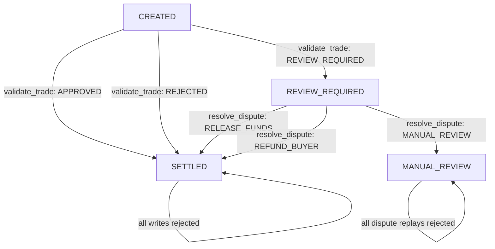

# Trust Africa

Trust Africa is a GenLayer-native escrow and trust workflow for African cross-border commerce. The deployed intelligent contract is the only authority for trade state, validation, disputes, escrow counters, and reputation changes.

## Deployment configuration

The frontend reads these Vite variables at build time:

```env
VITE_GENLAYER_NETWORK=testnetBradbury
VITE_GENLAYER_CONTRACT_ADDRESS=
```

The default network is Testnet Bradbury. The source repository did not contain a live deployed address, so the submitted deployment address must be supplied through `VITE_GENLAYER_CONTRACT_ADDRESS`; the UI refuses state-changing operations until it is configured. The same variables are exposed by Flask’s read-only `/config` endpoint for deployment diagnostics.

## Exact frontend-to-contract flow

1. The user connects a browser wallet through `window.ethereum`.
2. The app creates a read-only GenLayer client and, after connection, a separate wallet-signed write client.
3. The buyer wallet calls `create_trade(trade_id, buyer, seller, buyer_address, seller_address, product, amount, evidence)`.
4. The app waits for `TransactionStatus.FINALIZED` and checks `txExecutionResultName` before continuing.
5. The buyer or seller wallet calls `validate_trade(trade_id, evidence)`.
6. After another finalized successful receipt, the app reads `get_trade`, `get_trust_passport`, and `get_full_trust_report` through the read client.
7. A review-required trade can call `resolve_dispute(trade_id, buyer_claim, seller_response, evidence)` once, again waiting for finality and checking execution before reading state.

The UI displays the connected wallet address, configured contract address, every submitted transaction hash, execution result, and finalized status. It does not submit state changes to Flask.

## Contract state machine



Each trade stores the buyer and seller addresses, `validation_completed`, `dispute_resolved`, `settled`, `settlement_accounted`, and `status`. Escrow is held exactly once at creation and removed exactly once at settlement. Reputation counters are changed only inside that one settlement path.

## Authorization model

- Only the stored buyer address can create a trade.
- Only the stored buyer or seller address can validate or resolve that trade.
- Validation can run once and only from `CREATED`.
- Disputes can run once and only from `REVIEW_REQUIRED` or `DISPUTE_PENDING`.
- A settled trade rejects all further settlement processing.
- `update_reputation` and `issue_trust_passport` are owner-only writes.
- Read methods are `get_trade`, `get_trust_passport`, and `get_full_trust_report`.

## Backend boundary

Flask only serves `frontend/index.html`, static frontend assets, `/health`, and read-only deployment configuration at `/config`. `backend/trust_engine.py` and its tests were removed. There is no browser or production API route that performs keyword matching or maintains in-memory trade state.

## Run locally

```powershell
Copy-Item .env.example .env
npm install
npm run dev
```

Build the Vite bundle before serving it through Flask:

```powershell
npm run build
python backend/server.py
```

Set `VITE_GENLAYER_NETWORK`, `VITE_GENLAYER_CONTRACT_ADDRESS`, and `TRUST_AFRICA_CORS_ORIGINS` in the environment before running a deployment. A browser wallet and a funded account are required for writes.

## Validation commands

```powershell
genvm-lint check contracts/trust_africa_intelligent_contract.py
python -m pytest tests -v
gltest tests/integration/ -v -s --network testnet_bradbury
npm run check:frontend
npm run build
```

Direct tests cover participant authorization, owner-only writes, state transitions, dispute gating, replay prevention, finality-oriented receipt assertions in integration tests, and exact-once escrow/reputation accounting. Integration tests are marked `slow` and require a configured GenLayer environment.

## Validation in this checkout

- `genvm-lint lint contracts/trust_africa_intelligent_contract.py --json`: passed 3 checks.
- `genvm-lint check ... --json`: lint passed; SDK validation was blocked by the sandbox denying the GenVM download (`WinError 10013`).
- `python -m pytest tests -v`: 5 passed, 1 skipped, and 10 direct tests failed before contract execution for the same blocked GenVM download.
- `npm run check:frontend`: passed; `npm run build`: passed with Vite 8.1.5 after correcting the Vite CLI script.
- No live transaction was performed: there is no deployed address, wallet approval, funded account, GenLayer CLI, or transaction hash available here.
